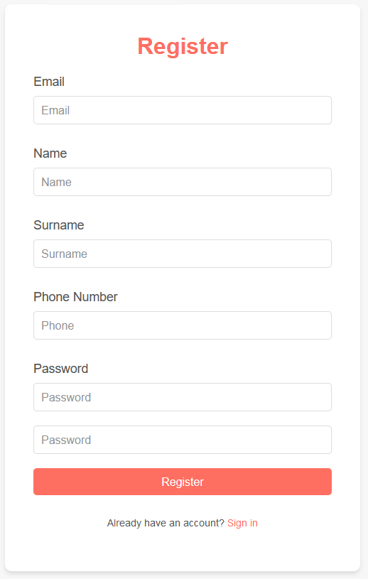
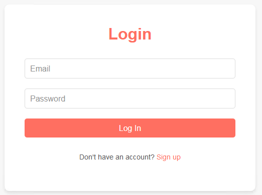
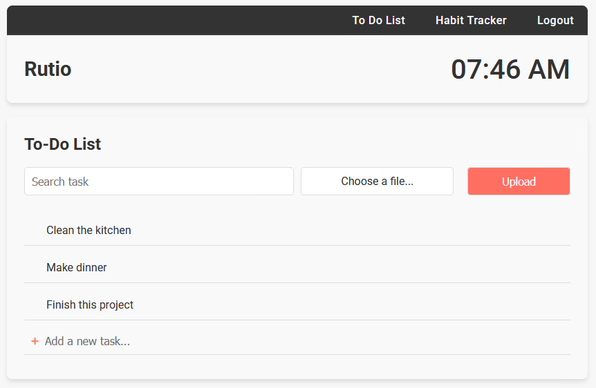

# Rutio – Aplikacja do śledzenia nawyków

## Spis Treści
* [Informacje Ogólne](#informacje-ogólne)
* [Technologie](#technologie)
* [Funkcje](#funkcje)
* [Zrzuty Ekranu](#zrzuty-ekranu)
* [Instalacja](#instalacja)
* [Dodatkowe pliki](#dodatkowe-pliki)
* [Użycie](#użycie)

## Informacje Ogólne
- Rutio to aplikacja webowa umożliwiająca śledzenie nawyków użytkownika, aby wspierać codzienną produktywność i samodyscyplinę.
- Oprócz śledzenia nawyków, aplikacja zawiera listę zadań, która pomaga użytkownikom w organizacji codziennych obowiązków.
- Rozwiązanie ma pomóc użytkownikom w tworzeniu, utrzymywaniu i analizie nawyków, co prowadzi do lepszego zarządzania czasem i osiągania celów.
- Projekt powstał z potrzeby prostego, intuicyjnego narzędzia, które pozwala na monitorowanie postępów w osiąganiu celów.

## Technologie
- **HTML, CSS, JavaScript** – Frontend aplikacji
- **PHP** – Backend obsługujący logikę aplikacji
- **PostgreSQL** – Baza danych do przechowywania informacji o użytkownikach i ich nawykach
- **Docker** – Użyty do uproszczenia wdrożenia aplikacji

## Funkcje
- **Śledzenie nawyków** – użytkownik może dodawać nawyki i śledzić postępy
- **Lista zadań – możliwość** tworzenia zadań, aby pomóc w organizacji codziennych obowiązków
- **Wyszukiwanie zadań** – łatwe wyszukiwanie konkretnego zadania w liście za pomocą słów kluczowych
- **Import zadań z pliku** – możliwość dodawania wielu zadań jednocześnie z pliku
- **Statystyki i wizualizacje** – analiza postępów w nawykach za pomocą przejrzystych wykresów
- **Intuicyjny interfejs** – przejrzysty układ strony, który zapewnia wygodne użytkowanie
- **Responsywność** – aplikacja dostosowuje się do różnych rozdzielczości ekranów
- **Logowanie i rejestracja** – zarządzanie użytkownikami za pomocą prostego systemu autoryzacji

## Zrzuty Ekranu

### Rejestracja
  
Ekran rejestracji pozwala użytkownikom na utworzenie nowego konta, wprowadzając podstawowe dane.

### Logowanie
 
Ekran logowania umożliwia autoryzację użytkowników, pozwalając im na dostęp do swoich danych i funkcji aplikacji po podaniu nazwy użytkownika oraz hasła.

### Śledzenie nawyków
  
Widok śledzenia nawyków, gdzie użytkownik może dodawać nawyki, oznaczać wykonane dni i monitorować swoje postępy.

### Lista zadań
  
Ekran listy zadań, który umożliwia tworzenie, edytowanie i usuwanie zadań. Lista zawiera opcję wyszukiwania, aby ułatwić zarządzanie obowiązkami.

## Instalacja
### Wymagania
- Zainstalowany Docker oraz Docker Compose
- Przeglądarka obsługująca HTML5

### Kroki instalacji
1. Klonowanie repozytorium
    - W konsoli użyć polecenia `git clone https://github.com/Yuviellia/Rutio.git`
    - Przejść do katalogu poleceniem `cd Rutio`
2. Uruchomienie aplikacji
    - Upewnić się że włączony jest docker
    - Uruchomić poleceniem `docker-compose up --build`
    - W przeglądarce wejść na `localhost:8080`
4. Po uruchomieniu można się zalogować przykładowymi danymi:
    - Email: `j@j.j`, hasło: `j`
    - Email: `h@h.h`, hasło: `h`

## Dodatkowe pliki
- Wyeksportowana baza danych w katalogu głównym: `database.sql`
- Prototyp z Figmy w katalogu `dockument`: `figma.pdf`
- Diagram ERD w katalogu `dockument`: `erd.png`

## Użycie
1. Niezalogowany użytkownik ma dostęp tylko do strony logowania i rejestracji.
2. Po zalogowaniu użytkownik przechodzi do strony `Habit Tracker`. Użytkownik może:
    - Dodać nowe zadanie wpisując jego nazwę w pole `Add a new task...` oraz zatwierdzając plusem
    - Usunąć zadanie klikająć kosz na śmieci, który pojawia się po najechaniu na nie myszką
    - Zaznaczyć pole przy odpowiednim dniu, żeby zanotować wykonany cel
    - Zmienić tydzień wybierając odpowiednią strzałkę nad tabelą
3. Użytkownik przechodzi do strony `To Do List`, wybierając ją z pasku nawigacji. Użytkownik może:
    - Dodać nową pozycję do listy wpisując jej nazwę w pole `Add a new task...` oraz zatwierdzając plusem
    - Usunąć pozycję klikająć kosz na śmieci, który pojawia się po najechaniu na nią myszką
    - Wyszukać pozycję po nazwie, wpisując słowa w pasek wyszukiwania
    - Zastąpić obecną listę, wybierając plik zawierający nowe pozycje i klikając `Upload`
4. Użytkownik wylogowuje się wybierając `Logout` z paska nawigacji

